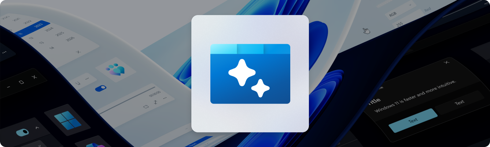

<h1 align="center">
    AI Dev Gallery (Preview)
</h1>

> [!IMPORTANT]  
> This app is currently in public preview. We are looking for feedback. Please let us know what you think by creating an [issue](https://github.com/microsoft/ai-dev-gallery/issues?q=sort%3Aupdated-desc+is%3Aissue+is%3Aopen).

The AI Dev Gallery is an app designed to help Windows app developers integrate AI capabilities within their own apps and projects. The app contains the following:

- **Interactive samples powered by local AI models**
- **Explore, download, and run models from Hugging Face and GitHub**
- **The ability to view source code and export visual studio project for each sample**

<p align="center">
<br/>


## 🚀 Getting Started
Follow the following guide to install the AI Dev Gallery locally:

### 1. Set up the Environment

>**⚠️ Note**: The AI Dev Gallery requires [Visual Studio 2022](https://visualstudio.microsoft.com/vs/) or later to build and Windows 10 or later to execute.
If you're building an app with the Windows App SDK for the first time, follow the [installation instructions here.](https://learn.microsoft.com/en-us/windows/apps/windows-app-sdk/set-up-your-development-environment)

**Required [Visual Studio components](https://learn.microsoft.com/en-us/windows/apps/windows-app-sdk/set-up-your-development-environment?tabs=cs-vs-community%2Ccpp-vs-community%2Cvs-2022-17-1-a%2Cvs-2022-17-1-b#required-workloads-and-components):**
- .NET Desktop Development.
- Windows App SDK C# Templates
- Windows 10 SDK (10.0.19041.0)

### 2. Clone the Repository

```shell
git clone https://github.com/microsoft/AI-Dev-Gallery.git
```

### 3. Open .sln with Visual Studio and Build!
```shell
.\AIDevGallery.sln

```

>**⚠️ Note**: Having issues installing the app on your machine? Let us know by <a href="https://github.com/microsoft/AI-Dev-Gallery/issues">opening an issue </a> and our team will do our best to help you.

<br/>

## Device Requirements
- **Minimum OS Version**: Windows 10, version 1809 (10.0; Build 17763)
- **Architecture**: x64, ARM64
- **Memory**: At least 16 GB is recommended
- **Disk Space**: At least 20GB free space is recommended
- **GPU**: 8GB of VRAM is recommended for running samples on the GPU

## 👏 Contribute to AI Dev Gallery

Any samples or docs improvements you'd like to see? We're always looking for a helping hand. Feel free to <a href="https://github.com/microsoft/AI-Dev-Gallery/issues">open an issue </a> to start the discussion, or even better, create a PR with the change you'd like to see!

<br/>

## ❓ FAQs
- **Q: Is a Microsoft account necessary to use the app?**
  - **A:** No, the app does NOT require a Microsoft account for use.
- **Q: Can I use the app without an internet connection?**
  - **A:** Yes, the app works offline since the AI models are downloaded locally. However, you will need to be online to download additional AI models from Hugging Face or Github.
- **Q: What AI models are available in the app?**
  - **A:** The app features popular open source models and will eventually include APIs from the <a href="https://learn.microsoft.com/windows/ai/overview">Windows Copilot Runtime</a>. When executing a sample, you can select which model you want to use.
- **Q: Is the app's source code accessible? Can I contribute new samples?**
  - **A:** Yes, the app is completely open-source, and its code is accessible on [GitHub](https://github.com/microsoft/AI-Dev-Gallery). Feel free to contribute by <a href="https://github.com/microsoft/AI-Dev-Gallery/issues">filing an issue</a>, or submitting a PR and one of our moderators will review it.
- **Q: Where can I provide feedback?**
  - **A:** Feel free to give us feedback or [open an issue](https://github.com/microsoft/AI-Dev-Gallery/issues/new) on our GitHub repository.
- **Q: Do I need to run the app just to try a single sample?**
  - **A:** Yes, the app is required to run any sample. However, once you've downloaded a model for a sample via the app, you can export the sample as a Visual Studio project and run it independently from there.

<br/>

## Contributing

This project welcomes contributions and suggestions.  Most contributions require you to agree to a
Contributor License Agreement (CLA) declaring that you have the right to, and actually do, grant us
the rights to use your contribution. For details, visit https://cla.opensource.microsoft.com.

When you submit a pull request, a CLA bot will automatically determine whether you need to provide
a CLA and decorate the PR appropriately (e.g., status check, comment). Simply follow the instructions
provided by the bot. You will only need to do this once across all repos using our CLA.

This project has adopted the [Microsoft Open Source Code of Conduct](https://opensource.microsoft.com/codeofconduct/).
For more information see the [Code of Conduct FAQ](https://opensource.microsoft.com/codeofconduct/faq/) or
contact [opencode@microsoft.com](mailto:opencode@microsoft.com) with any additional questions or comments.

<br/>

## Trademarks

This project may contain trademarks or logos for projects, products, or services. Authorized use of Microsoft 
trademarks or logos is subject to and must follow 
[Microsoft's Trademark & Brand Guidelines](https://www.microsoft.com/en-us/legal/intellectualproperty/trademarks/usage/general).
Use of Microsoft trademarks or logos in modified versions of this project must not cause confusion or imply Microsoft sponsorship.
Any use of third-party trademarks or logos are subject to those third-party's policies.

<br/>

## Code of Conduct
This project has adopted the <a href="https://github.com/microsoft/AI-Dev-Gallery/blob/main/CODE_OF_CONDUCT.md"> Microsoft Open Source Code of Conduct</a>.

<br/>

## Privacy Statement
The application logs basic telemetry. Please read the <a href="http://go.microsoft.com/fwlink/?LinkId=521839"> Microsoft privacy statement</a> for more information. 
