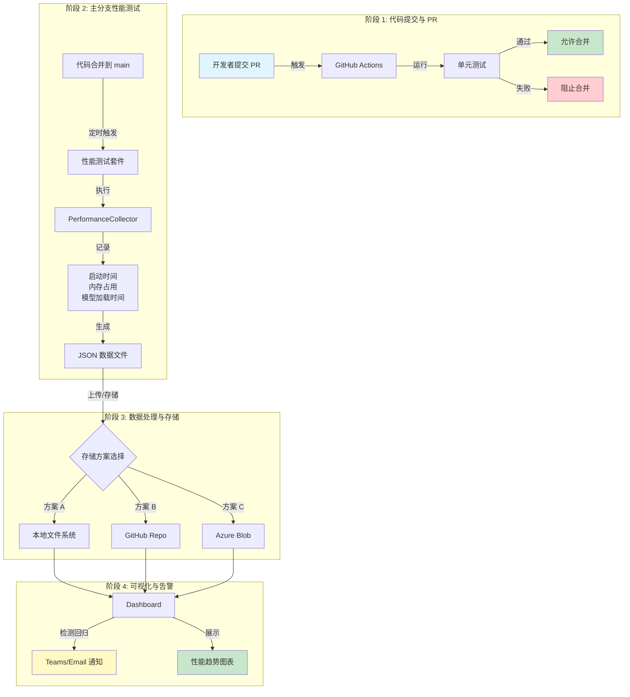
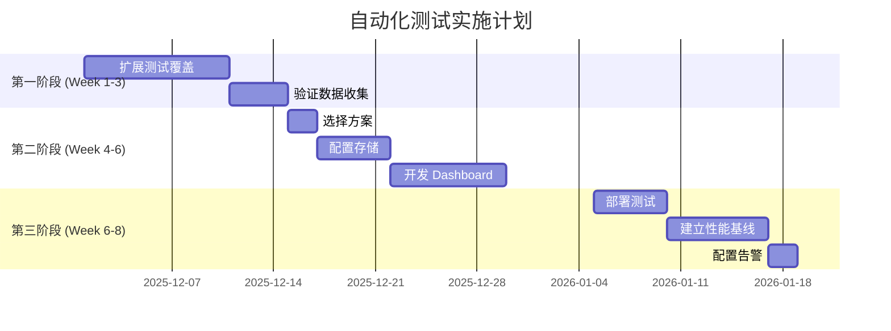

# AI Dev Gallery 自动化测试与性能监控方案 - 执行摘要

> **文档版本**: 1.0  
> **最后更新**: 2025-11-27  
> **状态**: 待审批  
> **详细技术文档**: [Automated-Testing-and-PowerBI-Pipeline-Design.md](./Automated-Testing-and-PowerBI-Pipeline-Design.md)

## 📋 目录

1. [项目目标](#1-项目目标)
2. [当前状态](#2-当前状态)
3. [方案对比与推荐](#3-方案对比与推荐)
4. [成本分析](#4-成本分析)
5. [实施计划](#5-实施计划)
6. [风险与缓解](#6-风险与缓解)
7. [决策建议](#7-决策建议)

---

## 1. 项目目标

### 1.1 核心目标
建立完整的自动化测试与性能监控体系，实现：
- ✅ **CI/CD 自动化测试**: 每次 PR 自动运行单元测试
- ✅ **性能数据收集**: 自动记录启动时间、内存占用、模型加载时间等关键指标
- ✅ **可视化 Dashboard**: 实时监控性能趋势，快速识别性能回归

### 1.2 预期收益
| 收益项目 | 量化指标 | 说明 |
|---------|---------|------|
| **减少手动测试时间** | ~80% | 自动化替代人工测试 |
| **性能问题发现时间** | 从数天到数小时 | 实时监控自动告警 |
| **发布质量** | 提升 40%+ | 阻止有缺陷代码合并 |
| **开发者信心** | 显著提升 | 持续反馈机制 |

---

## 2. 当前状态与技术选型

### 2.1 已完成工作 ✅
- ✅ 测试项目 (`AIDevGallery.Tests`) 已建立
- ✅ 性能收集器 (`PerformanceCollector`) 已实现
- ✅ 部分测试用例已编写（单元测试、UI 测试、性能测试）

### 2.2 待完成工作 🚧
- ⏳ PR 自动化测试流程需要优化
- ⏳ 性能测试覆盖率需要扩展
- ❌ **数据存储方案未确定** ← 需要决策
- ❌ **可视化 Dashboard 未实现** ← 需要决策
- ❌ 性能回归通知机制未配置

### 2.3 技术栈选型

#### 已确定的技术选型 ✅

| 组件 | 选择方案 | 理由 |
|------|---------|------|
| **测试框架** | MSTest | • 项目当前已使用<br>• 与 Visual Studio 和 .NET 集成最好<br>• 原生支持 WinUI 3 测试容器 |
| **UI 自动化** | UI Automation (UIA3) + FlaUI | • WinAppDriver 已停止维护<br>• FlaUI 对 WinUI 3 支持优秀<br>• 无需额外服务器进程，CI 配置简单 |
| **性能数据收集** | 自定义 PerformanceCollector | • 使用 Stopwatch 记录时间<br>• 使用 Process API 记录内存<br>• 输出 JSON 格式，易于解析 |
| **CI/CD 平台** | GitHub Actions | • 与 GitHub 紧密集成<br>• 免费额度 2000 分钟/月<br>• 配置简单，生态丰富 |

#### 待决策的技术选型 ⏳

| 组件 | 候选方案 | 决策依据 |
|------|---------|---------|
| **数据存储** | • 本地文件系统<br>• GitHub Repository<br>• Azure Blob Storage | 取决于是否有专用测试机和预算 |
| **Dashboard** | • Flask + Chart.js (自建)<br>• Grafana<br>• Power BI<br>• GitHub Pages | 取决于是否愿意开发和月度成本 |

### 2.4 整体流程架构



### 2.5 数据流详解

**步骤 1: 测试执行** (在 CI 或专用测试机上)
```
测试触发 → 性能测试运行 → PerformanceCollector 开始计时
              ↓
    测试逻辑执行 (启动应用、加载模型、导航页面等)
              ↓
    PerformanceCollector 记录指标 (时间、内存)
              ↓
    生成 JSON 文件 (包含元数据、环境信息、测量数据)
```

**步骤 2: 数据处理**
```
JSON 文件 → 上传到存储 → 数据处理脚本
                            ↓
                    转换为数据库格式 (SQLite/SQL)
                            ↓
                    检测性能回归 (对比历史数据)
                            ↓
                    如超过阈值 → 发送告警通知
```

**步骤 3: 可视化展示**
```
存储的数据 → Dashboard 读取 → 生成图表
                                  ↓
                    • 启动时间趋势图
                    • 内存占用对比图
                    • 模型加载时间分析
                    • 分支/提交对比视图
```

### 2.6 关键性能指标定义

| 指标名称 | 单位 | 描述 | 目标值 |
|---------|------|------|-------|
| `StartupTime` | ms | 应用从启动到主窗口就绪 | < 2000ms |
| `MemoryUsage_Startup` | MB | 启动后内存占用 (Private Memory) | < 200MB |
| `ModelLoadTime` | ms | 加载 AI 模型所需时间 | < 5000ms |
| `InferenceTime` | ms | 模型首次推理耗时 (TTFT) | < 1000ms |
| `NavigationTime` | ms | 页面切换耗时 | < 500ms |

**数据格式示例** (JSON Schema):
```json
{
  "Meta": {
    "RunId": "1234567890",
    "CommitHash": "a1b2c3d4",
    "Branch": "main",
    "Timestamp": "2025-11-27T10:30:00Z"
  },
  "Environment": {
    "OS": "Windows 10.0.22631",
    "Platform": "X64",
    "Configuration": "Release"
  },
  "Measurements": [
    {
      "Category": "Timing",
      "Name": "StartupTime",
      "Value": 1250.5,
      "Unit": "ms"
    }
  ]
}
```

---

## 3. 方案对比与推荐

### 3.1 快速方案对比

| 方案 | 月度成本 | 一次性投入 | Dashboard 开发 | 推荐度 | 适用场景 |
|-----|---------|-----------|--------------|-------|---------|
| 专用机 + 本地存储 + 自建 Dashboard | **$0** | $500-1000 (硬件) | 需要 (2-3 天) | ⭐⭐⭐⭐ | **有预算购买测试机** |
| GitHub Actions + GitHub Pages | **$0** | $0 | 需要 (2-3 天) | ⭐⭐ | **预算有限，无测试机** |
| GitHub Actions + Azure + Power BI | $10-50 | $0 | **无需开发** | ⭐⭐⭐ | 有 Azure 订阅 |
| 专用机 + 本地 + Power BI Desktop | $0 | $500-1000 (硬件) | **无需开发** (仅本地) | ⭐⭐⭐⭐ | 有测试机 + 想用 Power BI |
| GitHub Actions + OneDrive (M365) + Power BI Pro | $10-30 | $0 | **无需开发** | ⭐⭐⭐ | 已有 M365 订阅 |
| 专用机+Azure+Power BI | $10-50 | $500-1000 (硬件) | 需要 (2-3 天) | ⭐⭐⭐⭐⭐  | 双重保障 |

### 3.2 方案详细说明

#### 🏆 方案 A: 专用测试机 + 本地存储 + 自建 Dashboard

**架构**:
```
专用测试机 (Windows, 16GB RAM, 500GB SSD)
├── 定时任务运行性能测试
├── 本地存储 JSON 数据
├── SQLite 数据库
├── Flask Web Dashboard (自建)
└── Teams/Email 通知
```

**优点**:
- ✅ **零月度成本** (仅电费 ~$10-20/月)
- ✅ 完全可控，数据私有
- ✅ 实时监控，无延迟
- ✅ 环境稳定，易于调试

**缺点**:
- ❌ 需要购买硬件 ($500-1000)
- ❌ 需要开发 Dashboard (2-3 天)
- ❌ 需要维护物理设备

**推荐理由**: 长期成本最低，适合持续使用 (1 年后月均成本 < $100)

---

#### 🏆 方案 B: GitHub Actions + GitHub Pages（零投入推荐）

**架构**:
```
GitHub Actions (CI/CD)
├── 定时运行性能测试
├── 数据存储在 GitHub Repo (perf-data 分支)
├── Python 脚本生成静态 Dashboard
└── 发布到 GitHub Pages
```

**优点**:
- ✅ **完全免费** (零初期投入 + 零月费)
- ✅ 无需维护服务器
- ✅ 数据永久保存
- ✅ 可公开访问

**缺点**:
- ❌ 需要开发静态 Dashboard (2-3 天)
- ❌ Dashboard 交互能力有限
- ❌ 依赖 GitHub Actions 稳定性

**推荐理由**: 适合预算有限或短期项目，快速启动

---

#### 方案 C: Azure + Power BI（企业级，有成本）

**架构**:
```
GitHub Actions
├── 上传数据到 Azure Blob Storage (~$1-5/月)
├── Power BI 连接 Azure Blob
└── Power BI Service 发布 (~$10/用户/月)
```

**优点**:
- ✅ **零开发成本** (Power BI 图形界面配置)
- ✅ 企业级可视化能力
- ✅ 强大的交互和分析功能

**缺点**:
- ❌ 需要 Azure 订阅 (存储 + Power BI Pro)
- ❌ 月度成本 $10-50

**推荐理由**: 适合已有 Azure 订阅且需要高级分析的团队

---

#### 方案 A': 专用测试机 + Power BI Desktop（免费 Power BI）

**架构**:
```
专用测试机
├── 本地存储 JSON 数据
└── Power BI Desktop 读取本地文件夹（免费）
    ├── 仅本地使用，无团队云端共享
    └── 可手动刷新或自动刷新
```

**优点**:
- ✅ **零月度成本**
- ✅ **无需开发** (使用 Power BI 图形界面)
- ✅ 强大的可视化能力

**缺点**:
- ❌ 需要购买硬件 ($500-1000)
- ❌ 仅本地访问（团队需通过网络共享访问）
- ❌ 发布到云端需要 Power BI Pro

**推荐理由**: 想要免费使用 Power BI 且有专用测试机的团队

---

## 5. 实施计划

### 5.1 时间线 (预计 6-8 周)



### 5.2 里程碑检查点

| 阶段 | 里程碑 | 验收标准 | 责任人 |
|-----|-------|---------|-------|
| **第一阶段** | 测试覆盖完善 | • 90%+ 代码覆盖率<br>• 所有关键路径有测试 | QA Team |
| **第二阶段** | 基础设施就绪 | • 数据存储配置完成<br>• Dashboard 可访问 | Dev Team |
| **第三阶段** | 生产运行 | • 7 天稳定运行<br>• 性能基线建立 | DevOps |

---

## 6. 风险与缓解

### 6.1 主要风险

| 风险 | 影响 | 概率 | 缓解措施 |
|------|------|------|---------|
| **测试机硬件故障** | 高 | 低 | • 定期备份数据到云端<br>• 准备备用硬件 |
| **Dashboard 开发延期** | 中 | 中 | • 使用简化版先上线<br>• 考虑使用 Power BI 快速启动 |
| **性能测试不稳定** | 高 | 中 | • 建立重试机制<br>• 环境隔离 |
| **团队学习曲线** | 低 | 高 | • 提供培训文档<br>• 指定专人负责 |

### 6.2 技术风险

| 技术挑战 | 解决方案 |
|---------|---------|
| UI 测试 flaky | 使用 FlaUI + 增加等待时间 + 重试机制 |
| 数据量增长 | 定期归档旧数据 + 数据压缩 |
| Dashboard 性能 | 使用数据聚合 + 缓存机制 |

---

## 7. 决策建议

### 7.1 决策矩阵

**如果团队情况是...**

| 条件 | 推荐方案 | 原因 |
|------|---------|------|
| ✅ 有预算购买测试机 | **方案 A** | 长期成本最低，完全可控 |
| ✅ 完全零预算 | **方案 B** | 零投入，依赖 GitHub |
| ✅ 已有 Azure 订阅 | **方案 C** | 快速启动，企业级功能 |
| ✅ 有测试机 + 想用 Power BI | **方案 A'** | 免费 Power BI，强大可视化 |
| ✅ 已有 M365 + 想用 Power BI | **方案 B'** | 利用现有订阅，云端共享 |
| ✅ 技术团队强 + 想要自定义 | **方案 A** | 高度灵活，完全掌控 |
| ✅ 想快速启动（不想开发） | **方案 C / A' / B'** | 使用 Power BI，零开发 |

### 7.2 推荐优先级

#### 首选方案（强烈推荐）:
```
🥇 方案 A: 专用测试机 + 自建 Dashboard
   └─ 适合: 有硬件预算 + 长期使用 + 技术团队强
   └─ 优势: 零月费 + 完全可控 + 实时监控
```

#### 备选方案:
```
🥈 方案 B: GitHub Actions + GitHub Pages
   └─ 适合: 零预算 + 快速启动
   └─ 优势: 完全免费 + 无需维护硬件

🥉 方案 A': 专用测试机 + Power BI Desktop
   └─ 适合: 有测试机 + 想用 Power BI 但不想开发
   └─ 优势: 零月费 + Power BI 可视化 + 无需开发
```

### 7.3 需要立即决策的问题

**请管理层决策以下问题**:

1. ⭐ **是否批准购买专用测试机?** ($500-1000 一次性投入)
   - [ ] 是 → 选择方案 A 或 A'
   - [ ] 否 → 选择方案 B 或 B' 或 C

2. ⭐ **是否愿意投入开发时间构建自定义 Dashboard?** (2-3 天)
   - [ ] 是 → 方案 A 或 B
   - [ ] 否 → 方案 C / A' / B' (使用 Power BI)

3. ⭐ **是否接受月度云服务成本?** ($10-50/月)
   - [ ] 是 → 方案 C 或 B'
   - [ ] 否 → 方案 A / A' / B

4. **预期项目时间线?**
   - [ ] 4-6 周 (推荐)
   - [ ] 加急 (2-3 周) → 选择无需开发 Dashboard 的方案

---