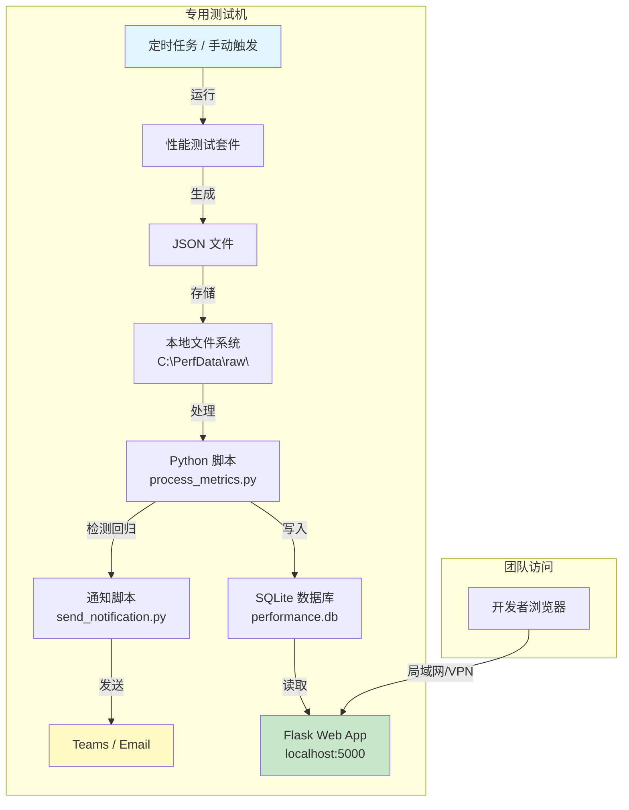
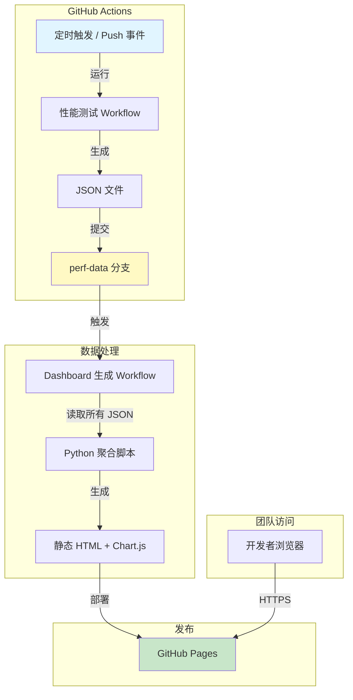
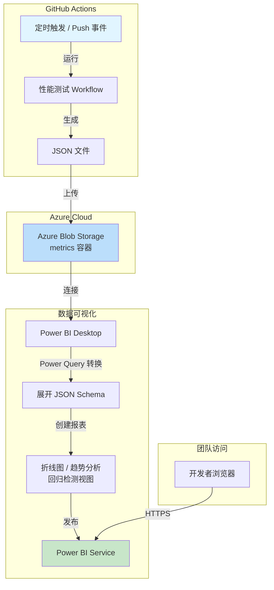
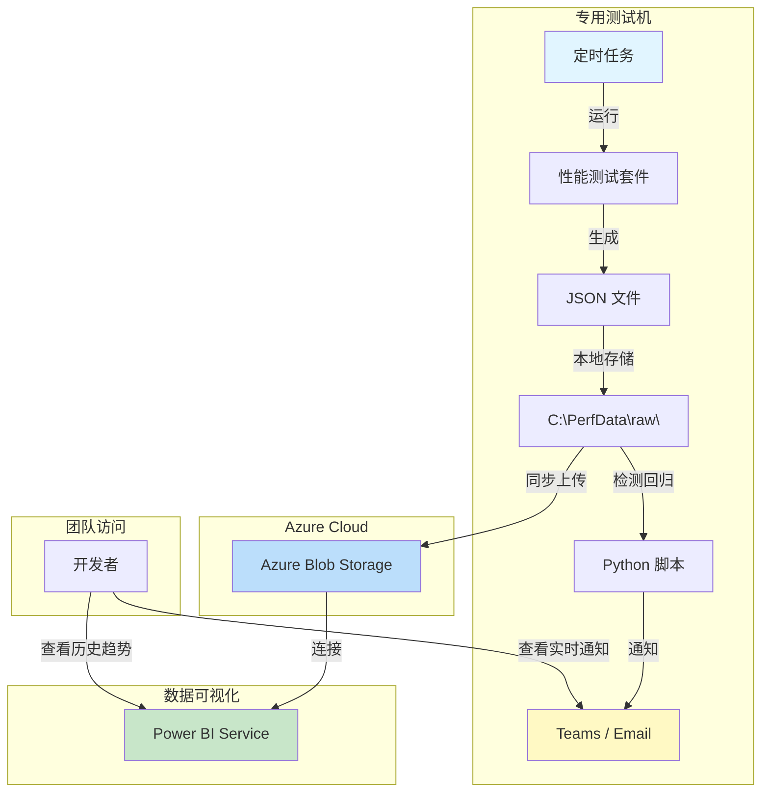
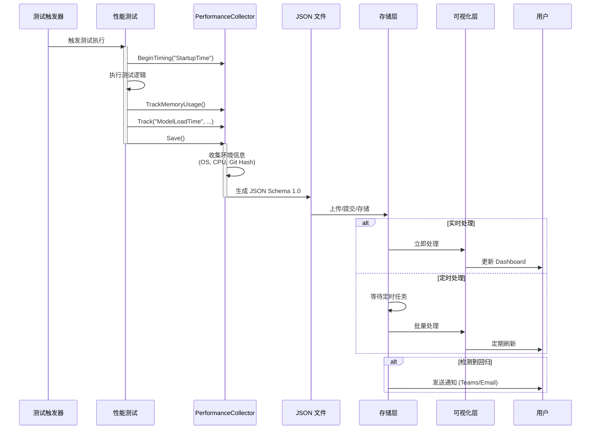

# AI Dev Gallery 自动化测试与性能监控设计文档

## 1. 概述

### 1.1 目标
建立一套完整的自动化测试与性能监控流水线，实现以下目标：
1.  **自动化测试**：在 CI/CD 中自动运行单元测试和 UI 测试。
2.  **性能数据收集**：在测试过程中收集关键性能指标（启动时间、内存占用、模型加载时间等）。
3.  **数据可视化**：将收集到的数据展示在、Dashboard 上，用于监控性能趋势和回归分析。

### 1.2 架构概览

**说明**: 根据数据存储方案的不同,数据可视化的实现方式也会有所差异(详见 2.5 节)。

### 1.3 完整方案成本对比总结

以下表格综合对比所有方案的成本构成，帮助您快速决策：

| 方案编号 | 方案名称 | 测试环境 | 数据存储 | Dashboard 可视化 | 月度成本估算 | 一次性投入 | 总成本评级 | 推荐场景 |
|---------|---------|---------|---------|----------------|------------|-----------|-----------|---------|
| **方案 A** | 专用机+本地<br/>+自建Dashboard | 专用测试机<br/>($500-1000) | 本地文件系统<br/>($0) | Flask/Grafana<br/>($0) | **$0/月** | $500-1000<br/>(硬件) | ⭐ 低 | 有预算购买设备<br/>技术团队强 |
| **方案 B** | GitHub Actions<br/>+GitHub Pages | GitHub Actions<br/>(免费2000分钟/月) | GitHub Repo<br/>($0) | Chart.js 静态页面<br/>($0) | **$0/月** | $0 | ⭐ 最低 | 无专用机<br/>预算有限 |
| **方案 C** | GitHub Actions<br/>+Azure+Power BI | GitHub Actions<br/>(免费) | Azure Blob<br/>($0.02/GB) | Power BI Pro<br/>($10/用户) | **$10-50/月** | $0 | ⭐⭐⭐ 中高 | 有 Azure 订阅<br/>需要企业级报表 |
| **方案 D** | 专用机+Azure<br/>+Power BI 混合 | 专用测试机<br/>($500-1000) | 本地+Azure Blob<br/>($0.02/GB) | Power BI Pro<br/>($10/用户) | **$10-50/月** | $500-1000<br/>(硬件) | ⭐⭐⭐⭐ 最高 | 大型团队<br/>双重保障 |
| **方案 A'** | 专用机+本地<br/>+Power BI Desktop | 专用测试机<br/>($500-1000) | 本地文件系统<br/>($0) | Power BI Desktop<br/>($0，仅本地) | **$0/月** | $500-1000<br/>(硬件) | ⭐ 低 | 有专用机<br/>想用 Power BI 但不发布到云 |
| **方案 B'** | GitHub Actions<br/>+OneDrive+PBI | GitHub Actions<br/>(免费) | OneDrive<br/>(M365 已含) | Power BI Pro<br/>($10/用户) | **$10-30/月**<br/>(如已有 M365 则更低) | $0 | ⭐⭐ 中 | 已有 M365 订阅<br/>想用 Power BI |

**成本详细说明**:

| 成本项目 | 选项 | 月度费用 | 备注 |
|---------|------|---------|------|
| **测试环境** | GitHub Actions (公共仓库) | $0 | 2000 分钟/月免费 |
| | GitHub Actions (私有仓库) | $0-$8+ | 超出 2000 分钟后 $0.008/分钟 |
| | 专用测试机 | $0 | 一次性硬件投入 $500-1000 |
| **数据存储** | GitHub Repository | $0 | 仓库大小无限制 (需定期清理) |
| | GitHub Actions Artifacts | $0 | 90 天自动删除 |
| | 本地文件系统 | $0 | 需购买存储设备 (已含在测试机中) |
| | Azure Blob Storage | $0.018-0.02/GB/月 | 约 $1-5/月 (假设 50-250GB) |
| | OneDrive (M365) | $0-5/月 | 如已有 M365 则免费 (1TB 存储) |
| | SQL Database (云端) | $15-100+/月 | 视规模而定，不推荐 |
| **Dashboard** | 自建 (Flask/Chart.js) | $0 | 需要开发时间 (2-3 天) |
| | Grafana (开源) | $0 | 需要配置时间 (1-2 天) |
| | GitHub Pages | $0 | 需要开发静态页面 (2-3 天) |
| | Power BI Desktop | $0 | 仅本地使用，无团队共享 |
| | Power BI Pro | $10/用户/月 | 支持云端共享和协作 |
| | Power BI Premium | $5000/月起 | 大型组织，不适用本项目 |
| **其他成本** | 专用测试机硬件 | 一次性 $500-1000 | 16GB RAM, 500GB SSD, Windows Pro |
| | 网络/电费 | ~$10-20/月 | 如果测试机 24/7 运行 |
| | Microsoft 365 (已有) | $0 | 如团队已有订阅，可使用 OneDrive |
| | Microsoft 365 (新购) | $6-12.5/用户/月 | Business Basic/Standard |

**关键决策点**:

1. **完全免费方案 (月度 $0)**:
   - ✅ 方案 A: 专用机 + 本地存储 + 自建 Dashboard (需硬件投入)
   - ✅ 方案 A': 专用机 + 本地存储 + Power BI Desktop (需硬件投入)
   - ✅ 方案 B: GitHub Actions + GitHub Pages (零投入，但需开发)

2. **低成本 Power BI 方案 (月度 $10-30)**:
   - ✅ 方案 B': GitHub Actions + OneDrive (M365) + Power BI Pro
   - ⚠️ 如果团队已有 M365 和 Power BI Pro，实际新增成本可能为 $0

3. **企业级方案 (月度 $10-50)**:
   - ✅ 方案 C: Azure + Power BI (适合已有 Azure 订阅的团队)

4. **最高成本方案 (月度 $10-70)**:
   - ⚠️ 方案 D: 专用机 + Azure + Power BI (硬件 + 云服务双重投入)

**ROI (投资回报率) 分析**:

- **方案 A (专用机)**: 初期投入 $500-1000，之后零月费，适合长期使用 (1 年后成本 < $100/月)
- **方案 B (GitHub)**: 零投入，但需开发时间 (~2-3 天 × 开发人员日薪)
- **方案 C (Azure+PBI)**: 月度 $10-50，零初期投入，适合短期项目或租用模式

---

## 2. 技术选型与评估

### 2.1 测试框架 (Test Framework)
*   **选择**: **MSTest**
*   **理由**:
    *   项目当前已使用 MSTest。
    *   与 Visual Studio 和 .NET 生态系统集成最好。
    *   原生支持 WinUI 3 测试容器。

### 2.2 UI 自动化框架 (UI Automation Framework)
*   **选择**: **UI Automation (UIA3) + FlaUI**
*   **理由**:
    *   **WinAppDriver** 已停止维护，且对 WinUI 3 支持不佳。
    *   **FlaUI** 是基于 UIA3 的优秀封装，性能高，稳定性好，且原生支持 WinUI 3 控件树。
    *   无需额外的服务器进程，CI 环境配置简单。

### 2.3 性能数据收集 (Performance Collection)
*   **选择**: **自定义测试指标收集器 (Custom Metrics Collector)**
*   **实现方式**:
    *   在测试代码中使用 `Stopwatch` 记录时间。
    *   使用 `Process.GetCurrentProcess()` 记录内存。
    *   将数据序列化为 **JSON** 格式文件。
*   **理由**:
    *   相比 ETW/WPR，JSON 文件更轻量，易于在 CI 中解析和上传。
    *   可以直接包含业务上下文（如"模型名称"、"硬件加速器类型"）。

### 2.4 数据存储 (Data Storage)
*   **待选方案对比**:

| 方案 | 优点 | 缺点 | 适用场景 |
|------|------|------|----------|
| **本地文件系统 (专用测试机)** | • **零外部依赖成本**<br>• 环境稳定可控<br>• 数据访问速度快<br>• 易于调试和排查问题<br>• 支持本地网络共享 | • 需要维护物理设备<br>• 需要配置网络访问<br>• 单点故障风险<br>• 需要手动备份 | **有专用测试机器的团队，推荐方案** |
| **GitHub Actions Artifacts** | • 免费且无需额外订阅<br>• 与 CI/CD 紧密集成<br>• 配置简单 | • 保留期限有限（90天）<br>• 不支持 Power BI 直接连接<br>• 需要额外处理才能聚合数据 | 短期性能监控，快速验证 |
| **GitHub Repository** | • 完全免费<br>• 数据永久保存<br>• 版本控制自动管理<br>• 可通过 GitHub API 访问 | • 会增加仓库大小<br>• 需要定期清理旧数据<br>• Power BI 集成需自定义脚本 | 长期历史数据保存，不需要频繁查询 |
| **Azure Blob Storage** | • 存储成本低<br>• Power BI 原生支持<br>• 无需维护数据库服务器 | • **需要长期维护 Azure 订阅**<br>• 订阅费用管理和预算控制<br>• 访问权限和安全策略配置<br>• 服务健康监控<br>• 团队权限管理 | 需要 Power BI 集成且有 Azure 订阅资源 |
| **SQL Database** | • 查询灵活<br>• 数据结构化 | • 成本较高<br>• 需要维护数据库<br>• 对简单指标过度设计 | 需要复杂查询和关联分析 |

*   **建议**: 
    *   **有专用测试机**: 优先使用**本地文件系统**存储，配合网络共享和本地 Web 服务实现可视化。
    *   **无专用测试机**: 优先考虑 **GitHub Actions Artifacts 或 GitHub Repository**，避免引入 Azure 订阅维护负担。

### 2.5 数据可视化 (Visualization)
*   **方案对比**(取决于数据存储方案):

| 存储方案 | 推荐可视化方案 | 实现方式 | 优缺点 |
|---------|--------------|---------|--------|
| **本地文件系统** | **本地 Web 服务器 +<br>Grafana / Chart.js** | • 在测试机上运行轻量级 Web 服务<br>• 实时读取本地 JSON 文件<br>• 通过局域网或 VPN 访问 | ✅ **零云服务成本**<br>✅ 实时更新,无延迟<br>✅ 完全可控<br>❌ 需要配置网络访问<br>❌ 测试机需保持运行 |
| **本地文件系统** | **Power BI Desktop +<br>定时刷新** | • Power BI Desktop 直接读取本地文件夹<br>• 配置定时刷新<br>• 可发布到团队内部共享 | ✅ 利用 Power BI 强大功能<br>✅ 无需云存储<br>❌ 需要访问测试机文件系统<br>❌ 发布到服务需 Power BI Pro |
| **本地文件系统** | **邮件/Teams 通知 +<br>静态报告** | • Python 脚本生成 HTML 报告<br>• 检测性能回归<br>• 通过邮件/Teams 发送通知 | ✅ 主动通知,无需手动查看<br>✅ 易于实现<br>❌ 不支持交互式查询 |
| **Azure Blob Storage** | Power BI | • Power BI 原生连接 Azure Blob<br>• 使用 Power Query 转换 JSON | ✅ 配置简单,功能强大<br>❌ 需要 Azure 订阅 |
| **GitHub Actions Artifacts** | Python + Matplotlib<br>或 Jupyter Notebook | • 定期下载 Artifacts<br>• 使用 Python 脚本聚合 JSON<br>• 生成静态图表或 HTML 报告 | ✅ 完全免费,灵活性高<br>❌ 需要手动调度,90天数据限制 |
| **GitHub Repository** | GitHub Pages +<br>Chart.js / Plotly | • 使用 GitHub Actions 读取 JSON 文件<br>• 生成静态 HTML Dashboard<br>• 发布到 GitHub Pages | ✅ 完全免费,数据永久保存<br>✅ 可公开访问<br>❌ 需要自行开发 Dashboard |

*   **建议**: 
    *   **有专用测试机**: 推荐 **本地 Web 服务器 + Grafana** 或 **邮件通知 + 静态报告**,实现零成本实时监控。
    *   **无专用测试机**: 使用 **GitHub Repository + GitHub Pages + Chart.js**,完全免费且易于维护。
    *   **进阶方案**: 如果团队已有 Azure 订阅且熟悉 Power BI,可使用 Azure Blob Storage + Power BI。

## 3. 详细设计

### 3.1 性能指标定义
我们需要收集以下关键指标：

| 指标名称 | 单位 | 描述 | 收集方式 | 分类 |
|---------|------|------|----------|------|
| `StartupTime` | ms | 应用从启动到主窗口就绪的时间 | UI 测试中使用 `Stopwatch` | Timing |
| `MemoryUsage_Startup` | MB | 启动后的内存占用 (Private Memory) | `PerformanceCollector.TrackMemoryUsage()` | Memory |
| `MemoryUsage_Startup_WorkingSet` | MB | 启动后的工作集内存 | 自动随 Private Memory 记录 | Memory |
| `ModelLoadTime` | ms | 加载特定 AI 模型所需时间 | 集成测试/UI 测试中记录 | Timing |
| `InferenceTime` | ms | 模型首次推理耗时 (TTFT) | 集成测试中记录 | Timing |
| `NavigationTime` | ms | 页面切换耗时 | UI 测试中记录 | Timing |

**注意**: 
*   所有指标都支持 `Category` 属性进行分类（如 "Timing", "Memory", "General"）。
*   内存指标会同时记录 Private Memory 和 Working Set 两个值。
*   可使用 `PerformanceCollector.BeginTiming()` 自动计时。

### 3.2 数据结构 (JSON Schema)
每个测试运行将生成一个 JSON 文件，包含详细的元数据、环境信息和测量数据。

**当前实现的完整 Schema**:

```json
{
  "Meta": {
    "SchemaVersion": "1.0",
    "RunId": "1234567890",
    "CommitHash": "a1b2c3d4e5f6...",
    "Branch": "main",
    "Timestamp": "2025-11-27T10:30:00.000Z",
    "Trigger": "push"
  },
  "Environment": {
    "OS": "Microsoft Windows 10.0.22631",
    "Platform": "X64",
    "Configuration": "Release",
    "Hardware": {
      "Cpu": "Intel(R) Core(TM) i7-10750H CPU @ 2.60GHz",
      "Ram": "16 GB",
      "Gpu": ""
    }
  },
  "Measurements": [
    {
      "Category": "Timing",
      "Name": "StartupTime",
      "Value": 1250.5,
      "Unit": "ms",
      "Tags": {
        "os": "windows-11",
        "testType": "UI"
      }
    },
    {
      "Category": "Memory",
      "Name": "MemoryUsage_Startup",
      "Value": 145.7,
      "Unit": "MB",
      "Tags": {
        "processId": "12345"
      }
    },
    {
      "Category": "Memory",
      "Name": "MemoryUsage_Startup_WorkingSet",
      "Value": 178.2,
      "Unit": "MB",
      "Tags": {
        "processId": "12345"
      }
    },
    {
      "Category": "Timing",
      "Name": "ModelLoadTime",
      "Value": 4500.0,
      "Unit": "ms",
      "Tags": {
        "model": "Phi-3-mini",
        "accelerator": "CPU"
      }
    }
  ]
}
```

**Schema 说明**:

| 字段路径 | 类型 | 说明 | 来源 |
|---------|------|------|------|
| `Meta.SchemaVersion` | string | Schema 版本号 | 固定为 "1.0" |
| `Meta.RunId` | string | 构建/运行 ID | `GITHUB_RUN_ID` / `BUILD_BUILDID` / "local-run" |
| `Meta.CommitHash` | string | Git 提交哈希 | `GITHUB_SHA` / `BUILD_SOURCEVERSION` / "local-sha" |
| `Meta.Branch` | string | Git 分支名 | `GITHUB_REF_NAME` / `BUILD_SOURCEBRANCHNAME` / "local-branch" |
| `Meta.Timestamp` | datetime | 测试运行时间 (UTC) | `DateTime.UtcNow` |
| `Meta.Trigger` | string | 触发方式 | `GITHUB_EVENT_NAME` / `BUILD_REASON` / "manual" |
| `Environment.OS` | string | 操作系统描述 | `RuntimeInformation.OSDescription` |
| `Environment.Platform` | string | 处理器架构 | `RuntimeInformation.ProcessArchitecture` |
| `Environment.Configuration` | string | 构建配置 | "Debug" 或 "Release" |
| `Environment.Hardware.*` | object | 硬件信息 | 通过环境变量或 GC API 获取 |
| `Measurements[]` | array | 性能测量列表 | 测试执行期间收集 |
| `Measurements[].Category` | string | 指标分类 | "Timing" / "Memory" / "General" |
| `Measurements[].Name` | string | 指标名称 | 自定义 |
| `Measurements[].Value` | number | 测量值 | 实际测量结果 |
| `Measurements[].Unit` | string | 单位 | "ms" / "MB" / "s" 等 |
| `Measurements[].Tags` | object | 可选的标签 | 用于过滤和分组 |

### 3.3 CI/CD 流水线集成 (GitHub Actions)

#### 步骤 0: PR 触发单元测试（必须）
在每个 PR 的新 commit 时自动运行单元测试，确保代码质量。

**测试过滤说明**:
- `TestCategory!=Performance&TestCategory!=UITest`: 排除性能测试和 UI 测试（这些通常较慢）
- 只运行快速的单元测试，确保 PR 反馈迅速
- 使用 `fail-on-error: true` 确保测试失败时阻止合并

#### 步骤 1: 运行性能测试并生成数据
在 `build.yml` 或新的 `performance.yml` 中（通常在主分支或定时触发）：

**注意**:
- 测试项目路径为 `AIDevGallery.Tests\AIDevGallery.Tests.csproj`
- `PerformanceCollector.Save()` 会自动读取 `PERFORMANCE_OUTPUT_PATH` 环境变量
- 如果未设置环境变量，默认输出到 `<BaseDirectory>\PerfResults`
- 生成的 JSON 文件格式为 `perf-yyyyMMdd-HHmmss-<guid>.json`
- 性能测试通常不在 PR 中运行，而是在合并后或定时触发

#### 步骤 2: 上传数据(根据存储方案选择)

**方案 A: 上传到 GitHub Actions Artifacts**
```yaml
- name: Upload Performance Data
  uses: actions/upload-artifact@v4
  with:
    name: performance-metrics
    path: ${{ github.workspace }}\PerfResults\*.json
    retention-days: 90
```

**方案 B: 提交到 GitHub Repository**
```yaml
- name: Commit Performance Data
  run: |
    git config user.name "github-actions[bot]"
    git config user.email "github-actions[bot]@users.noreply.github.com"
    git checkout -B perf-data
    git add ${{ github.workspace }}\PerfResults\*.json
    git commit -m "Add performance data for build ${{ github.run_id }}"
    git push origin perf-data --force
```

**方案 C: 上传到 Azure Blob Storage**
```yaml
- name: Upload Performance Data
  uses: azure/CLI@v1
  with:
    inlineScript: |
      az storage blob upload-batch \
        --account-name aidevgalleryperf \
        --destination metrics \
        --source ${{ github.workspace }}\PerfResults \
        --pattern "*.json"
```

### 3.4 数据可视化集成步骤

#### 方案 A: Power BI 数据连接（多种选择）

##### 选项 1: Azure Blob Storage（云端，推荐用于 CI/CD）
**适用场景**: GitHub Actions + Azure 订阅

1.  **获取数据**: 选择 "Azure Blob Storage"。
2.  **连接**: 输入存储账户名称。
3.  **转换数据 (Power Query)**:
    *   展开 `Content` 列(解析 JSON)。
    *   展开 `Meta` 对象获取元数据字段。
    *   展开 `Environment` 对象获取环境信息。
    *   展开 `Measurements` 列表。
    *   转换数据类型(时间戳、数值)。
4.  **创建报表**:
    *   创建折线图:X轴为 `Meta.Timestamp`,Y轴为 `Measurements.Value`,图例为 `Measurements.Name`。
    *   添加切片器:`Meta.Branch`, `Environment.Platform`, `Environment.Configuration`, `Measurements.Category`。
    *   按 `Measurements.Category` 创建不同的视图(Timing vs Memory)。

**优点**: ✅ 云端存储，团队易访问 | ✅ Power BI Service 原生支持  
**缺点**: ❌ 需要 Azure 订阅（~$0.02/GB/月）

---

##### 选项 2: 本地文件夹（**零成本，推荐用于专用测试机**）
**适用场景**: 有专用测试机 + 想要免费使用 Power BI

1.  **获取数据**: Power BI Desktop → "获取数据" → 选择 "**文件夹**" (Folder)。
2.  **指定路径**: 
    *   本地路径: `C:\PerfTestEnvironment\PerfData\raw`
    *   网络路径: `\\TestMachine\PerfData\raw` (需配置网络共享)
3.  **合并文件**: Power BI 自动识别并合并文件夹中的所有 JSON 文件。
4.  **转换数据**: 与选项 1 相同的 Power Query 步骤。
5.  **刷新策略**:
    *   **Power BI Desktop**: 手动刷新或设置自动刷新间隔（免费）。
    *   **Power BI Service**: 需配置 On-premises Data Gateway（用于发布到云端共享）。

**优点**: ✅ **完全免费**，无云服务成本 | ✅ 直接读取本地数据，速度快  
**缺点**: ❌ 团队成员需访问测试机文件系统（通过网络共享或 VPN）

---

##### 选项 3: OneDrive / SharePoint（**Microsoft 365 用户**）
**适用场景**: 团队已有 Microsoft 365 订阅

1.  **同步数据**: 
    *   GitHub Actions: 将 JSON 文件上传到 OneDrive 或 SharePoint。
    *   专用测试机: 使用 OneDrive 同步文件夹。
2.  **获取数据**: Power BI → "OneDrive - 企业版" 或 "SharePoint 文件夹"。
3.  **转换数据**: 标准 Power Query 步骤。
4.  **自动刷新**: Power BI Service 原生支持，无需 Gateway。

**优点**: ✅ 如果已有 M365 则免费 | ✅ 云端同步 | ✅ 团队易访问  
**缺点**: ❌ 需要 Microsoft 365 订阅

---

##### 选项 4: GitHub（通过 Web API，**高级用户**）
**适用场景**: 数据在 GitHub + 想避免其他云服务

1.  **获取数据**: Power BI → "Web" 连接器。
2.  **GitHub API**: 
    ```
    https://api.github.com/repos/{owner}/{repo}/contents/PerfResults?ref=perf-data
    ```
3.  **认证**: 配置 GitHub Personal Access Token。
4.  **Power Query 处理**:
    ```m
    // 示例代码（简化）
    let
        Source = Json.Document(Web.Contents("https://api.github.com/...")),
        Files = Table.FromList(Source, Splitter.SplitByNothing()),
        Decoded = Table.AddColumn(Files, "Content", each 
            Json.Document(Binary.FromText([content], BinaryEncoding.Base64)))
    in
        Decoded
    ```

**优点**: ✅ 完全免费 | ✅ 数据永久保存  
**缺点**: ❌ 配置复杂 | ❌ API 速率限制 | ❌ 需要高级 Power Query 技能

---

##### 选项 5: SQL Database（**高级场景**）
**适用场景**: 需要复杂查询或已有数据库

1.  **数据处理**: 使用 `process_metrics.py` 将 JSON 写入数据库。
2.  **支持的数据库**: SQLite (本地), SQL Server, PostgreSQL, MySQL。
3.  **Power BI 连接**: 选择对应的数据库连接器。
4.  **查询优化**: 使用 SQL 直接过滤和聚合数据。

**优点**: ✅ 查询性能最佳 | ✅ 支持复杂分析  
**缺点**: ❌ 需要维护数据库 | ❌ 云数据库有成本

---

#### 方案 B: GitHub Pages + Chart.js
1.  **创建 GitHub Actions Workflow** 生成静态 Dashboard:
    ```yaml
    - name: Generate Dashboard
      run: |
        python scripts/generate_dashboard.py
    - name: Deploy to GitHub Pages
      uses: peaceiris/actions-gh-pages@v3
      with:
        github_token: ${{ secrets.GITHUB_TOKEN }}
        publish_dir: ./dashboard
    ```
2.  **Python 脚本** (`generate_dashboard.py`) 读取所有 JSON 文件并生成 HTML。
3.  **访问 Dashboard**: `https://<username>.github.io/<repo>/`

#### 方案 C: Python + Jupyter Notebook
1.  定期从 GitHub Actions Artifacts 或 Repository 下载 JSON 文件。
2.  使用 Pandas 读取和聚合数据。
3.  使用 Matplotlib/Plotly 生成趋势图。
4.  可选:将 Notebook 发布为静态 HTML 报告。

## 4. 实施计划

### 当前状态
*   ✅ **测试项目**: `AIDevGallery.Tests` 项目已完成，包含單元測試、集成測試、UI測試、性能測試。
*   ✅ **性能收集器**: `PerformanceCollector` 类已实现，支持 JSON Schema (Meta/Environment/Measurements)。
*   ⏳ **PR 单元测试**: GitHub Actions 工作流确保每次 PR 运行单元测试。
*   ⏳ **性能测试**: 部分性能测试用例已实现，需扩展更多场景。
*   ⏳ **CI/CD 集成**: 性能测试工作流需要配置（`performance.yml`）。
*   ❌ **数据存储**: 尚未选择和配置最终存储方案。
*   ❌ **可视化 Dashboard**: 尚未实现。
*   ❌ **性能回归通知**: 尚未配置 Teams/邮件通知机制。

### 第一阶段：完善性能测试用例 (Week 1-2)
1.  **扩展测试覆盖**:
    *   编写更多性能测试场景（参考 Section 6.2 示例）：
        - 应用启动时间测试
        - 模型加载时间测试
        - 页面导航性能测试
        - 内存使用监控测试
    *   为每个测试添加 `[TestCategory("Performance")]` 标记。
    *   确保测试稳定性，避免偶发性失败。

2.  **验证数据收集**:
    *   在本地运行性能测试，验证 JSON 文件生成正确。
    *   检查 JSON Schema 是否符合 Section 3.2 定义。
    *   测试环境变量读取（`PERFORMANCE_OUTPUT_PATH`）。

### 第二阶段：选择并配置数据存储与可视化方案 (Week 3-4)

**方案 A: 专用测试机（推荐，如有条件）**
1.  **硬件准备**:
    *   准备一台专用 Windows 测试机。
    *   按照 Section 5.2 配置目录结构。
2.  **脚本部署**:
    *   部署测试执行脚本 `run_tests.ps1`。
    *   部署数据处理脚本 `process_metrics.py`。
    *   部署通知脚本 `send_notification.py`。
3.  **Dashboard 搭建**:
    *   部署 Flask Web 应用（Section 5.4）。
    *   配置网络访问和防火墙规则。
4.  **定时任务**:
    *   使用 Windows Task Scheduler 配置每日测试运行。
5.  **通知配置**:
    *   设置 Teams Webhook 或邮件服务。
    *   配置性能回归阈值。

**方案 B: GitHub Repository + GitHub Pages（无专用机）**
1.  **配置 GitHub Actions Workflow** (`performance.yml`):
    *   定时触发或主分支合并后触发性能测试。
    *   将生成的 JSON 文件提交到 `perf-data` 分支。
2.  **创建 Dashboard 生成脚本**:
    *   Python 脚本读取 `perf-data` 分支的所有 JSON 文件。
    *   聚合数据并生成静态 HTML Dashboard（使用 Chart.js）。
3.  **发布到 GitHub Pages**:
    *   使用 GitHub Actions 自动部署 Dashboard。
    *   访问 `https://<org>.github.io/<repo>/`。

**方案 C: Azure Blob + Power BI（如有 Azure 订阅）**
1.  **配置 Azure Blob Storage**:
    *   创建存储账户和容器。
    *   配置访问密钥或 SAS Token。
2.  **修改 GitHub Actions Workflow**:
    *   添加 Azure CLI 步骤上传 JSON 文件。
3.  **配置 Power BI**:
    *   连接到 Azure Blob Storage。
    *   使用 Power Query 转换 JSON 数据（参考 Section 3.4）。
    *   创建折线图、趋势分析、回归检测视图。
4.  **发布报表**:
    *   发布到 Power BI Service 供团队访问。

### 第三阶段：监控与优化 (Ongoing)
1.  **性能基线建立**:
    *   收集 2-4 周的稳定数据。
    *   确定各指标的正常范围和回归阈值。
2.  **回归检测**:
    *   配置自动化回归检测逻辑。
    *   设置警报通知（Teams/Email）。
3.  **持续改进**:
    *   根据 Dashboard 数据识别性能瓶颈。
    *   优化关键路径性能。
    *   定期审查和更新测试用例。

### 决策建议
*   **有专用测试机**: 选择 **方案 A**，享受零成本、实时监控、完全可控的优势。
*   **无专用测试机 + 希望免费**: 选择 **方案 B**，完全基于 GitHub 生态，无额外成本。
*   **已有 Azure 订阅 + 需要强大可视化**: 选择 **方案 C**，利用 Power BI 的高级分析能力。

## 5. 专用测试机方案详细设计

### 5.1 架构图

根据不同的资源配置，我们提供以下四种架构方案：

#### 5.1.1 方案 A：专用测试机 + 本地存储 + 本地 Dashboard



**特点**:
- ✅ 无云服务成本
- ✅ 数据完全可控
- ✅ 实时更新
- ✅ 主动通知
- ❌ 需要维护物理设备
- ❌ 需要自行开发 Dashboard（Flask + Chart.js，或使用 Grafana 等开源工具）

---

#### 5.1.2 方案 B：GitHub Actions + GitHub Repository + GitHub Pages



**特点**:
- ✅ 完全免费
- ✅ 数据永久保存
- ✅ 可公开访问
- ✅ 无需维护服务器
- ❌ 需要自行开发静态 Dashboard（Python 脚本生成 HTML + Chart.js）

---

#### 5.1.3 方案 C：GitHub Actions + Azure Blob Storage + Power BI



**特点**:
- ✅ Power BI 强大的可视化能力
- ✅ 原生支持 Azure Blob
- ✅ 企业级报表功能
- ✅ dashboard零开发成本，使用 Power BI 图形界面配置，无需编写代码
- ❌ 需要 Azure 订阅
- ❌ 需要 Power BI Pro

---

#### 5.1.4 方案 D：专用测试机 + Azure Blob Storage + Power BI（混合方案）



**特点**:
- ✅ 结合专用机的稳定性和 Power BI 的可视化能力
- ✅ 双重保障：本地实时监控 + 云端历史分析
- ✅ 灵活的通知机制
- ✅ Dashboard 使用 Power BI，零开发成本，直接使用企业级可视化工具
- ❌ 成本较高（设备 + Azure 订阅 + Power BI Pro）
- ❌ 维护复杂度最高

---

#### 5.1.5 方案對比總結

| 項目 | 方案 A<br/>專用機+本地 | 方案 B<br/>GitHub Pages | 方案 C<br/>Azure+Power BI | 方案 D<br/>混合方案 |
|------|---------------------|---------------------|----------------------|------------------|
| **Dashboard 開發需求** | ✅ **需要開發**<br/>Flask + Chart.js<br/>或使用 Grafana | ✅ **需要開發**<br/>Python 腳本生成<br/>靜態 HTML | ❌ **無需開發**<br/>使用 Power BI<br/>圖形界面配置 | ❌ **無需開發**<br/>使用 Power BI |
| **開發工作量** | 中等<br/>(~2-3天) | 中等<br/>(~2-3天) | 極低<br/>(~2小時配置) | 極低<br/>(~2小時配置) |
| **技術棧要求** | Python, Flask<br/>JavaScript, SQL | Python, Jinja2<br/>HTML/CSS/JS | Power Query<br/>DAX (可選) | Power Query<br/>DAX (可選) |
| **Dashboard 功能** | 高度自定義<br/>完全可控 | 靜態報表<br/>有限交互 | 企業級功能<br/>豐富交互 | 企業級功能<br/>豐富交互 |
| **成本** | $0 | $0 | Azure + Power BI Pro<br/>(~$10-50/月) | 設備 + Azure + PBI<br/>(最高) |
| **維護負擔** | 中等 | 低 | 低 | 高 |
| **推薦場景** | 有專用機<br/>技術團隊強 | 無專用機<br/>預算有限 | 有 Azure 訂閱<br/>需要高級報表 | 大型團隊<br/>需要雙重保障 |

**關鍵結論**:
- ✅ **完全免費且無需開發 Dashboard**: 無此選項（所有免費方案都需要開發）
- ✅ **無需開發 Dashboard**: 只有方案 C 和方案 D（使用 Power BI）
- ✅ **免費但需要開發**: 方案 A 和方案 B
- ❌ **使用 Grafana 等開源工具**: 可減少開發量，但仍需配置和集成工作

---

#### 5.1.6 数据流详解（通用）



---

### 5.2 环境配置

#### 5.2.1 测试机要求
*   **操作系统**: Windows 10/11 Pro (支持远程访问)
*   **硬件**: 
    *   至少 16GB RAM
    *   500GB SSD (用于存储历史数据)
    *   稳定的网络连接
*   **软件依赖**:
    *   .NET SDK
    *   Python 3.10+
    *   Git

#### 5.2.2 目录结构
```
C:\PerfTestEnvironment\
├── AIDevGallery\              # 代码仓库
├── PerfData\                  # 性能数据存储
│   ├── raw\                   # 原始 JSON 文件
│   │   └── 2025-11-27\
│   │       ├── perf-xxx.json
│   │       └── perf-yyy.json
│   └── database\              # SQLite 数据库
│       └── performance.db
├── Dashboard\                 # Web Dashboard 代码
│   ├── app.py
│   ├── templates\
│   └── static\
├── Scripts\                   # 自动化脚本
│   ├── run_tests.ps1
│   ├── process_metrics.py
│   ├── send_notification.py
│   └── start_dashboard.ps1
└── Logs\                      # 日志文件
```

### 5.3 自动化脚本

#### 5.3.1 测试执行脚本 (`run_tests.ps1`)
```powershell
# 定时运行测试并收集性能数据
param(
    [string]$Branch = "main"
)

$ErrorActionPreference = "Stop"
$BaseDir = "C:\PerfTestEnvironment"
$RepoDir = "$BaseDir\AIDevGallery"
$DataDir = "$BaseDir\PerfData\raw\$(Get-Date -Format 'yyyy-MM-dd')"

# 更新代码
Set-Location $RepoDir
git fetch origin
git checkout $Branch
git pull

# 创建数据目录
New-Item -ItemType Directory -Force -Path $DataDir | Out-Null

# 运行性能测试
$env:PERFORMANCE_OUTPUT_PATH = $DataDir
dotnet test AIDevGallery.Tests\AIDevGallery.Tests.csproj `
    -c Release `
    --filter "TestCategory=Performance" `
    --logger "trx;LogFileName=$BaseDir\Logs\test-results-$(Get-Date -Format 'yyyyMMdd-HHmmss').trx"

# 触发数据处理
python "$BaseDir\Scripts\process_metrics.py" --input $DataDir
```

#### 5.3.2 数据处理脚本 (`process_metrics.py`)
```python
import json
import sqlite3
from pathlib import Path
from datetime import datetime

class PerformanceProcessor:
    def __init__(self, db_path: str):
        self.conn = sqlite3.connect(db_path)
        self.create_tables()
    
    def create_tables(self):
        self.conn.execute('''
            CREATE TABLE IF NOT EXISTS metrics (
                id INTEGER PRIMARY KEY,
                timestamp TEXT,
                run_id TEXT,
                commit_hash TEXT,
                branch TEXT,
                trigger TEXT,
                os TEXT,
                platform TEXT,
                configuration TEXT,
                category TEXT,
                metric_name TEXT,
                metric_value REAL,
                metric_unit TEXT,
                tags TEXT
            )
        ''')
        self.conn.commit()
    
    def process_json_files(self, data_dir: Path):
        """处理指定目录下的所有 JSON 文件 (新 Schema 格式)"""
        for json_file in data_dir.glob("*.json"):
            with open(json_file, 'r', encoding='utf-8') as f:
                data = json.load(f)
            
            # 提取元数据和环境信息
            meta = data.get("Meta", {})
            env = data.get("Environment", {})
            
            # 处理每个测量数据
            for measurement in data.get("Measurements", []):
                self.conn.execute('''
                    INSERT INTO metrics 
                    (timestamp, run_id, commit_hash, branch, trigger,
                     os, platform, configuration, category,
                     metric_name, metric_value, metric_unit, tags)
                    VALUES (?, ?, ?, ?, ?, ?, ?, ?, ?, ?, ?, ?, ?)
                ''', (
                    meta.get("Timestamp"),
                    meta.get("RunId"),
                    meta.get("CommitHash"),
                    meta.get("Branch"),
                    meta.get("Trigger"),
                    env.get("OS"),
                    env.get("Platform"),
                    env.get("Configuration"),
                    measurement.get("Category", "General"),
                    measurement["Name"],
                    measurement["Value"],
                    measurement["Unit"],
                    json.dumps(measurement.get("Tags", {}))
                ))
        
        self.conn.commit()
    
    def check_regression(self, metric_name: str, threshold: float = 1.15):
        """检查性能回归：新值是否比历史平均值高出 15%"""
        cursor = self.conn.execute('''
            SELECT metric_value 
            FROM metrics 
            WHERE metric_name = ? 
            ORDER BY timestamp DESC 
            LIMIT 10
        ''', (metric_name,))
        
        values = [row[0] for row in cursor.fetchall()]
        if len(values) < 2:
            return False
        
        latest = values[0]
        avg_previous = sum(values[1:]) / len(values[1:])
        
        return latest > avg_previous * threshold

# 使用示例
if __name__ == "__main__":
    import argparse
    parser = argparse.ArgumentParser()
    parser.add_argument("--input", required=True)
    args = parser.parse_args()
    
    processor = PerformanceProcessor("C:/PerfTestEnvironment/PerfData/database/performance.db")
    processor.process_json_files(Path(args.input))
    
    # 检查关键指标是否回归
    if processor.check_regression("StartupTime"):
        # 发送通知
        print("⚠️ Performance regression detected in StartupTime!")
        # 这里可以调用 send_notification.py
```

#### 5.3.3 通知脚本 (`send_notification.py`)
```python
import requests
import json

def send_teams_notification(webhook_url: str, message: str):
    """发送 Teams 通知"""
    payload = {
        "@type": "MessageCard",
        "@context": "https://schema.org/extensions",
        "summary": "Performance Regression Detected",
        "themeColor": "FF0000",
        "title": "🚨 Performance Alert",
        "text": message
    }
    
    response = requests.post(webhook_url, json=payload)
    return response.status_code == 200

def send_email_notification(to_email: str, subject: str, body: str):
    """发送邮件通知"""
    # 配置 SMTP 服务器
    # 实现略...
    pass
```

### 5.4 Web Dashboard (Flask)

#### 5.4.1 应用代码 (`Dashboard/app.py`)
```python
from flask import Flask, render_template, jsonify
import sqlite3
from datetime import datetime, timedelta

app = Flask(__name__)
DB_PATH = "C:/PerfTestEnvironment/PerfData/database/performance.db"

@app.route('/')
def dashboard():
    return render_template('dashboard.html')

@app.route('/api/metrics/<metric_name>')
def get_metric_data(metric_name):
    """获取指定指标的历史数据"""
    conn = sqlite3.connect(DB_PATH)
    cursor = conn.execute('''
        SELECT timestamp, metric_value, branch
        FROM metrics
        WHERE metric_name = ?
        ORDER BY timestamp DESC
        LIMIT 100
    ''', (metric_name,))
    
    data = [{
        'timestamp': row[0],
        'value': row[1],
        'branch': row[2]
    } for row in cursor.fetchall()]
    
    conn.close()
    return jsonify(data)

@app.route('/api/latest')
def get_latest_metrics():
    """获取最新一次测试的所有指标"""
    conn = sqlite3.connect(DB_PATH)
    cursor = conn.execute('''
        SELECT metric_name, metric_value, metric_unit
        FROM metrics
        WHERE timestamp = (SELECT MAX(timestamp) FROM metrics)
    ''')
    
    data = [{
        'name': row[0],
        'value': row[1],
        'unit': row[2]
    } for row in cursor.fetchall()]
    
    conn.close()
    return jsonify(data)

if __name__ == '__main__':
    app.run(host='0.0.0.0', port=5000)
```

#### 5.4.2 前端模板 (`Dashboard/templates/dashboard.html`)
```html
<!DOCTYPE html>
<html>
<head>
    <title>Performance Dashboard</title>
    <script src="https://cdn.jsdelivr.net/npm/chart.js"></script>
</head>
<body>
    <h1>AI Dev Gallery Performance Dashboard</h1>
    <div id="latest-metrics"></div>
    <canvas id="startupTimeChart"></canvas>
    <canvas id="memoryChart"></canvas>
    
    <script>
        // 加载最新指标
        fetch('/api/latest')
            .then(r => r.json())
            .then(data => {
                const container = document.getElementById('latest-metrics');
                data.forEach(metric => {
                    container.innerHTML += `<p><strong>${metric.name}</strong>: ${metric.value} ${metric.unit}</p>`;
                });
            });
        
        // 加载历史趋势图
        fetch('/api/metrics/StartupTime')
            .then(r => r.json())
            .then(data => {
                new Chart(document.getElementById('startupTimeChart'), {
                    type: 'line',
                    data: {
                        labels: data.map(d => d.timestamp).reverse(),
                        datasets: [{
                            label: 'Startup Time (ms)',
                            data: data.map(d => d.value).reverse()
                        }]
                    }
                });
            });
    </script>
</body>
</html>
```

### 5.5 部署步骤

#### 第一步：配置测试机
1.  在测试机上创建目录结构。
2.  克隆代码仓库到 `C:\PerfTestEnvironment\AIDevGallery`。
3.  安装 Python 依赖：`pip install flask requests`。

#### 第二步：配置定时任务
使用 Windows Task Scheduler 创建定时任务：
*   **触发器**: 每天凌晨 2:00 AM
*   **操作**: 运行 `powershell.exe -File C:\PerfTestEnvironment\Scripts\run_tests.ps1`

#### 第三步：启动 Dashboard
创建 Windows 服务或使用 Task Scheduler 开机自启动：
```powershell
python C:\PerfTestEnvironment\Dashboard\app.py
```

#### 第四步：配置网络访问
*   在 Windows 防火墙中开放端口 5000。
*   配置路由器端口转发(如需外网访问)。
*   或使用 VPN 让团队成员访问内网。

#### 第五步：配置通知
*   创建 Teams Incoming Webhook。
*   在 `process_metrics.py` 中配置 Webhook URL。

### 5.6 优势总结
*   ✅ **零云服务成本**：无需 Azure/AWS 订阅。
*   ✅ **环境稳定**：测试机配置固定，减少环境差异。
*   ✅ **实时监控**：数据本地存储，Dashboard 实时更新。
*   ✅ **主动通知**：检测到性能回归自动发送 Teams/邮件通知。
*   ✅ **易于扩展**：可轻松添加更多指标和图表。

## 6. 代码示例

### 6.1 性能收集器 (C#)

```csharp
public class PerformanceMetrics
{
    public string BuildId { get; set; }
    public string CommitHash { get; set; }
    public DateTime Timestamp { get; set; }
    public List<Metric> Metrics { get; set; } = new();
}

public class Metric
{
    public string Name { get; set; }
    public double Value { get; set; }
    public string Unit { get; set; }
    public Dictionary<string, string> Tags { get; set; }
}

public static class PerformanceCollector
{
    private static readonly List<Metric> _metrics = new();

    public static void Track(string name, double value, string unit, Dictionary<string, string> tags = null)
    {
        _metrics.Add(new Metric { Name = name, Value = value, Unit = unit, Tags = tags });
    }

    public static void Save(string path)
    {
        var data = new PerformanceMetrics
        {
            BuildId = Environment.GetEnvironmentVariable("GITHUB_RUN_ID") 
                     ?? $"local-{DateTime.Now:yyyyMMdd-HHmmss}",
            CommitHash = GetGitCommitHash(),
            Timestamp = DateTime.UtcNow,
            Metrics = _metrics
        };
        
        var json = JsonSerializer.Serialize(data, new JsonSerializerOptions 
        { 
            WriteIndented = true 
        });
        
        var fileName = $"perf-{DateTime.UtcNow:yyyyMMddHHmmss}-{Guid.NewGuid():N}.json";
        File.WriteAllText(Path.Combine(path, fileName), json);
    }
    
    private static string GetGitCommitHash()
    {
        try
        {
            var process = new Process
            {
                StartInfo = new ProcessStartInfo
                {
                    FileName = "git",
                    Arguments = "rev-parse HEAD",
                    RedirectStandardOutput = true,
                    UseShellExecute = false,
                    CreateNoWindow = true
                }
            };
            process.Start();
            var hash = process.StandardOutput.ReadToEnd().Trim();
            process.WaitForExit();
            return hash;
        }
        catch
        {
            return "unknown";
        }
    }
}
```

### 6.2 测试用例示例

**示例 1: 使用手动计时和内存跟踪**
```csharp
[TestMethod]
[TestCategory("Performance")]
public void StartupTimeTest()
{
    var stopwatch = Stopwatch.StartNew();
    
    // 启动应用
    var app = Application.Launch("AIDevGallery.exe");
    var window = app.GetMainWindow(automation);
    
    stopwatch.Stop();
    
    // 记录启动时间
    PerformanceCollector.Track("StartupTime", stopwatch.ElapsedMilliseconds, "ms", 
        category: "Timing");
    
    // 记录内存（会自动记录 Private Memory 和 Working Set）
    PerformanceCollector.TrackMemoryUsage(app.ProcessId, "MemoryUsage_Startup");
    
    // 保存性能数据
    PerformanceCollector.Save(); // 自动使用 PERFORMANCE_OUTPUT_PATH 环境变量
}
```

**示例 2: 使用自动计时（推荐）**
```csharp
[TestMethod]
[TestCategory("Performance")]
public void ModelLoadTimeTest()
{
    // 使用 using 语句自动计时
    using (PerformanceCollector.BeginTiming("ModelLoadTime", 
        tags: new Dictionary<string, string> { 
            { "model", "Phi-3-mini" }, 
            { "accelerator", "CPU" } 
        },
        category: "Timing"))
    {
        // 加载模型的代码
        LoadModel("Phi-3-mini");
    } // 自动记录耗时
    
    PerformanceCollector.Save();
}
```

**示例 3: 综合测试**
```csharp
[TestMethod]
[TestCategory("Performance")]
public void ComprehensivePerformanceTest()
{
    int appProcessId = 0;
    
    // 启动时间
    using (PerformanceCollector.BeginTiming("StartupTime", category: "Timing"))
    {
        var app = Application.Launch("AIDevGallery.exe");
        var window = app.GetMainWindow(automation);
        appProcessId = app.ProcessId;
    }
    
    // 启动后内存
    PerformanceCollector.TrackMemoryUsage(appProcessId, "MemoryUsage_Startup");
    
    // 导航时间
    using (PerformanceCollector.BeginTiming("NavigationTime_ToModels", category: "Timing"))
    {
        NavigateToModelsPage();
    }
    
    // 模型加载
    using (PerformanceCollector.BeginTiming("ModelLoadTime", 
        tags: new Dictionary<string, string> { { "model", "Phi-3" } },
        category: "Timing"))
    {
        LoadModel("Phi-3");
    }
    
    // 加载后内存
    PerformanceCollector.TrackMemoryUsage(appProcessId, "MemoryUsage_AfterModelLoad");
    
    // 保存所有收集的指标
    string savedPath = PerformanceCollector.Save();
    Console.WriteLine($"Performance data saved to: {savedPath}");
    
    // 清理（为下一个测试做准备）
    PerformanceCollector.Clear();
}
```
